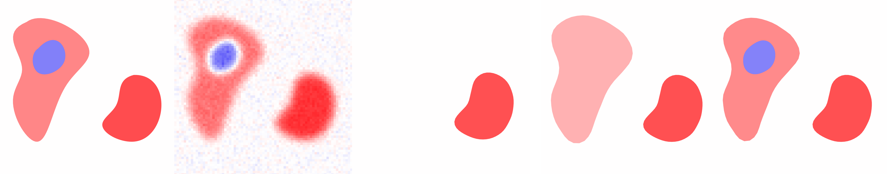

# Total (gradient) variation sliding Frank-Wolfe

  

Implementation of the modified Frank-Wolfe algorithm described in [[1]](https://arxiv.org/abs/2104.06706). Under active development. See also 
[this repository](https://github.com/rpetit/PyCheeger). *A demo notebook is available in the examples folder*.

Acknowledgments: we thank Robert Tovey for carefuly reviewing this implementation, and for suggesting several modifications that significantly improved its performance. 

[[1]](https://arxiv.org/abs/2104.06706) De Castro, Y., Duval, V., & Petit, R. (2023). Towards off-the-grid algorithms for total variation regularized inverse problems. Journal of Mathematical Imaging and Vision, 65(1), 53-81.
